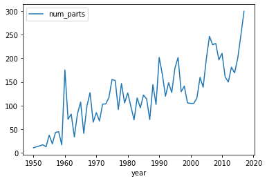

```python
import pandas as pd
colors=pd.read_csv('/Users/yifeisun/Desktop/colors.csv')
colors.head()
```


<div>
<style scoped>
    .dataframe tbody tr th:only-of-type {
        vertical-align: middle;
    }

    .dataframe tbody tr th {
        vertical-align: top;
    }

    .dataframe thead th {
        text-align: right;
    }
</style>
<table border="1" class="dataframe">
  <thead>
    <tr style="text-align: right;">
      <th></th>
      <th>id</th>
      <th>name</th>
      <th>rgb</th>
      <th>is_trans</th>
    </tr>
  </thead>
  <tbody>
    <tr>
      <th>0</th>
      <td>-1</td>
      <td>Unknown</td>
      <td>0033B2</td>
      <td>f</td>
    </tr>
    <tr>
      <th>1</th>
      <td>0</td>
      <td>Black</td>
      <td>05131D</td>
      <td>f</td>
    </tr>
    <tr>
      <th>2</th>
      <td>1</td>
      <td>Blue</td>
      <td>0055BF</td>
      <td>f</td>
    </tr>
    <tr>
      <th>3</th>
      <td>2</td>
      <td>Green</td>
      <td>237841</td>
      <td>f</td>
    </tr>
    <tr>
      <th>4</th>
      <td>3</td>
      <td>Dark Turquoise</td>
      <td>008F9B</td>
      <td>f</td>
    </tr>
  </tbody>
</table>
</div>


```python
#How many distinct colorts are available?
num=colors.rgb.size
print("There are %d kinds of colors"%num)
```

    There are 135 kinds of colors


```python
colors_sum=colors.groupby('is_trans').count()
print(colors_sum)
```

               id  name  rgb
    is_trans                
    f         107   107  107
    t          28    28   28


```python
%matplotlib inline
sets=pd.read_csv('/Users/yifeisun/Desktop/sets.csv')
parts_by_year=sets[['year','num_parts']].groupby('year').mean()
parts_by_year.plot()
```


    <AxesSubplot:xlabel='year'>


    

    


```python
#lego themes over years
themes_yearly=sets.groupby('year')[['theme_id']].nunique()
themes_yearly.head()
```


<div>
<style scoped>
    .dataframe tbody tr th:only-of-type {
        vertical-align: middle;
    }

    .dataframe tbody tr th {
        vertical-align: top;
    }

    .dataframe thead th {
        text-align: right;
    }
</style>
<table border="1" class="dataframe">
  <thead>
    <tr style="text-align: right;">
      <th></th>
      <th>theme_id</th>
    </tr>
    <tr>
      <th>year</th>
      <th></th>
    </tr>
  </thead>
  <tbody>
    <tr>
      <th>1950</th>
      <td>2</td>
    </tr>
    <tr>
      <th>1953</th>
      <td>1</td>
    </tr>
    <tr>
      <th>1954</th>
      <td>2</td>
    </tr>
    <tr>
      <th>1955</th>
      <td>4</td>
    </tr>
    <tr>
      <th>1956</th>
      <td>3</td>
    </tr>
  </tbody>
</table>
</div>


```python
#get the no of unique themes released in 1955,1999
num_themes=themes_yearly.loc[1955,'theme_id']
num_themes_1999=themes_yearly.loc[1999,'theme_id']
print("ID in 1955 is %d"%num_themes,'and another ID in 1999 is %d'%num_themes_1999)
```

    ID in 1955 is 4 and another ID in 1999 is 71


```python

```
